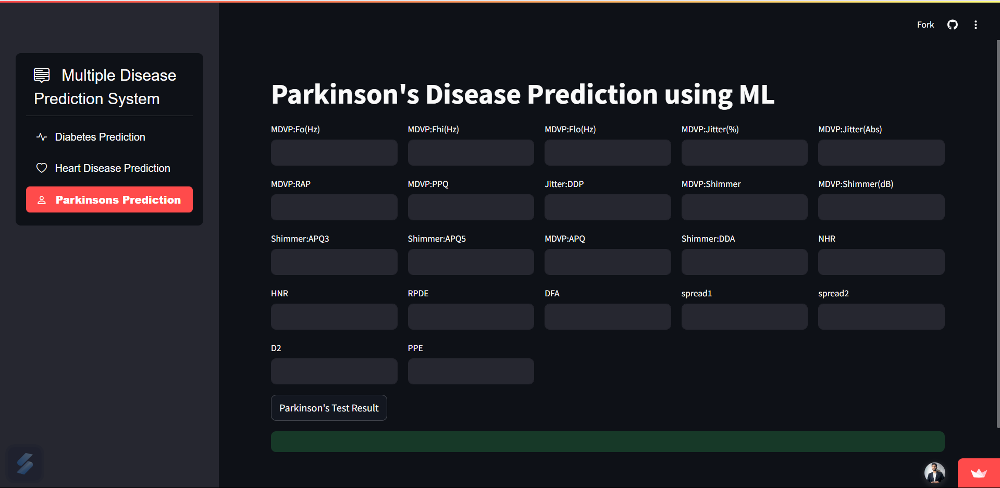

# Multiple Disease Prediction System

### To Test Project

👉 [Project Link](https://multiple-disease-prediction---system.streamlit.app/)

A machine learning-based web application that predicts multiple diseases (Diabetes, Heart Disease, Parkinson's Disease, etc.) using patient symptoms and medical data.

## 🔍 Web Interface Preview

*(This screenshot shows the Parkinson’s Disease prediction form from the web interface)*

## Features

- **Multi-Disease Prediction**: Predicts likelihood of Diabetes, Heart Disease, and Parkinson's Disease  
- **User-Friendly Interface**: Simple web form for inputting medical parameters  
- **Machine Learning Models**: Trained models for each disease prediction  
- **Responsive Design**: Works on desktop and mobile devices  

## Technologies Used

### Frontend
- HTML5, CSS3  
- JavaScript  
- Bootstrap 5  

### Backend
- Python  
- Flask  

### Machine Learning
- Scikit-learn  
- Pandas  
- NumPy  

### Deployment
- Heroku (or alternative)  

## Installation

### Prerequisites
- Python 3.8+  
- pip  
- virtualenv (recommended)

## Contact

Project Maintainer - [Parag Nema](https://github.com/paragnema1)  
For questions or suggestions, please open an issue on GitHub.

## Acknowledgements

Dataset sources: Kaggle, UCI Machine Learning Repository
